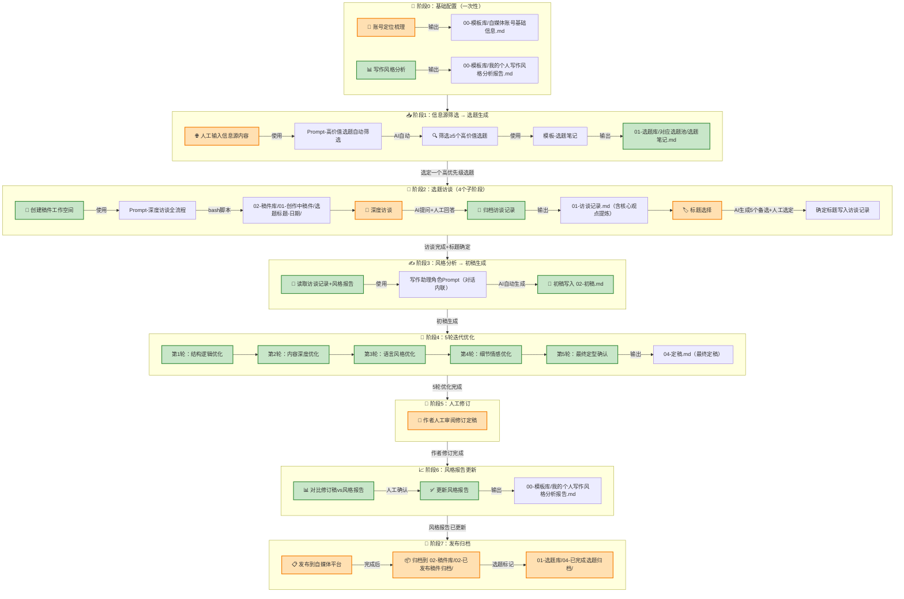

# 我的内容生产流程图

**创建日期：** 2026-06-04
**版本：** v1.0
**基于稿件：** 《从翻车到高效：我的AI编程SOP工作流（附完整步骤）》完整生产过程复盘

---

## 一、流程总览（Mermaid 流程图）



**图例说明：**
- 🟠 **橙色节点** = 需要人工参与（人工）
- 🟢 **绿色节点** = AI全自动完成（自动）
- 🔵 **蓝色节点** = 输出文件

---

## 二、知识库结构说明

| 文件夹 | 用途 | 核心文件 |
|--------|------|----------|
| `00-模板库/` | 存放所有Prompt模板、报告、账号信息 | 4个Prompt + 4个模板 + 2个报告/信息文件 |
| `01-选题库/` | 存放所有选题笔记，分3个池子+1个归档 | 01-热点选题池 / 02-用户痛点选题池 / 03-行业干货选题池 / 04-已完成选题归档 |
| `02-稿件库/` | 存放所有稿件，分创作中和已发布归档 | 01-创作中稿件 / 02-已发布稿件归档 |
| `03-素材库/` | 存放历史文章、行业资料、图片视频素材 | 01-历史文章素材 / 02-行业资料素材 / 03-图片视频素材 |
| `04-日常素材/` | 存放日常收集的碎片化素材 | 散落的素材文件 |

---

## 三、每个步骤详细说明

### 阶段0：基础配置（一次性，后续可迭代更新）

#### 0.1 账号定位梳理

| 项目 | 内容 |
|------|------|
| **输入** | 无（从零开始访谈） |
| **使用Prompt** | `00-模板库/Prompt-账号定位梳理.md` |
| **参与方式** | 🟠 **人工+AI**：AI通过访谈式提问，人工逐一回答 |
| **AI职责** | 按6个路径逐步提问（个人背景→目标受众→核心价值→内容方向→平台选择→更新节奏） |
| **人工职责** | 回答每个问题，确认最终结果 |
| **输出文件** | `00-模板库/自媒体账号基础信息.md` |
| **触发时机** | 首次搭建时执行一次；定位调整时重新执行 |

#### 0.2 写作风格分析

| 项目 | 内容 |
|------|------|
| **输入** | `03-素材库/01-历史文章素材/` 中的所有历史文章 |
| **使用Prompt** | `00-模板库/Prompt-个人写作风格分析.md` |
| **参与方式** | 🟢 **AI全自动**：AI读取所有历史文章，自动分析8个维度 |
| **分析维度** | 标题风格、开头风格、行文结构、用词习惯、语气语调、金句特点、结尾风格、其他特点 |
| **输出文件** | `00-模板库/我的个人写作风格分析报告.md` |
| **触发时机** | 首次搭建时执行一次；每次有新文章定稿后可更新（阶段6） |

---

### 阶段1：信息源筛选 → 选题生成

| 项目 | 内容 |
|------|------|
| **输入** | 外部信息源内容（行业新闻、技术文章、社交媒体热点等） |
| **使用Prompt** | `00-模板库/Prompt-高价值选题自动筛选.md` |
| **参与方式** | 🟠 **人工+AI**：人工提供信息源 → AI自动筛选选题 |
| **人工职责** | 1. 收集信息源内容 2. 粘贴到Prompt中 3. 审阅AI生成的选题 |
| **AI职责** | 1. 按筛选标准（强相关、有痛点、有价值、有壁垒、可落地）筛选选题 2. 为每个选题生成标准化笔记 3. 自动存入对应选题池 |
| **使用模板** | `00-模板库/模板-选题笔记.md` |
| **输出文件** | `01-选题库/01-热点选题池/` 或 `02-用户痛点选题池/` 或 `03-行业干货选题池/` 中的选题笔记 |
| **筛选标准** | 强相关、有痛点、有价值、有壁垒、可落地 |
| **输出数量** | ≥5个高价值选题 |
| **选题内容** | 标题、目标受众、核心痛点、3个切入角度、创作优先级、素材来源 |

---

### 阶段2：选题访谈（4个子阶段）

| 项目 | 内容 |
|------|------|
| **输入** | 从选题库中选定一个高优先级选题笔记 |
| **使用Prompt** | `00-模板库/Prompt-深度访谈全流程.md` |
| **使用模板** | `00-模板库/模板-访谈记录.md` |

#### 2.1 创建稿件工作空间

| 项目 | 内容 |
|------|------|
| **参与方式** | 🟢 **AI全自动**：通过bash脚本创建 |
| **AI职责** | 1. 提取选题标题 2. 执行bash脚本创建文件夹和文件 3. 读取模板填充变量 4. 确认创建成功 |
| **输出文件** | `02-稿件库/01-创作中稿件/{选题标题}-{YYYYMMDD}/` 文件夹，包含：`01-访谈记录.md`、`02-初稿.md`、`03-改稿记录.md`、`04-定稿.md`、`assets/` |

#### 2.2 深度访谈

| 项目 | 内容 |
|------|------|
| **参与方式** | 🟠 **人工+AI**：AI提问，人工回答 |
| **AI职责** | 1. 每次提出1个问题 2. 附上引导语 3. 根据回答动态调整下一个问题 4. 追问简短或有趣的回答 5. 判断是否收集到足够素材 |
| **人工职责** | 1. 回答每个问题 2. 可以要求AI帮忙编撰部分内容（如"这里你帮我编"） |
| **访谈路径** | 背景引入 → 痛点共鸣 → 干货实操 → 认知升华 |
| **追问机制** | 回答少于2句话 / 提到有趣经历未展开 / 回答偏通用 / 关键信息被一笔带过 |
| **结束判断** | 收集到完整的4条链路：开头背景 + 痛点共鸣 + 实操干货 + 认知升华 |

#### 2.3 归档访谈记录

| 项目 | 内容 |
|------|------|
| **参与方式** | 🟢 **AI全自动** |
| **AI职责** | 1. 将完整问答记录写入 `01-访谈记录.md` 2. 提炼3-5个核心观点 3. 摘录金句 4. 推荐文章核心骨架 5. 分析内容亮点与差异化 |
| **输出内容** | frontmatter + 访谈问答全记录 + 访谈核心观点提炼（核心观点、金句、骨架建议、亮点差异化） |

#### 2.4 标题选择

| 项目 | 内容 |
|------|------|
| **参与方式** | 🟠 **人工+AI**：AI生成备选，人工选定 |
| **AI职责** | 1. 基于访谈内容生成5个备选标题 2. 每个标题附带说明（击中什么痛点） 3. 将确定标题写入访谈记录 |
| **人工职责** | 1. 选择标题 2. 或提出修改意见 |
| **标题要求** | 贴合痛点、类型多样化、简洁有力、符合风格报告 |

---

### 阶段3：风格分析 → 初稿生成

| 项目 | 内容 |
|------|------|
| **输入** | `01-访谈记录.md`（确定标题+访谈内容+核心骨架）+ `00-模板库/我的个人写作风格分析报告.md` |
| **使用Prompt** | 写作助理角色Prompt（在对话中内联，非独立模板文件） |
| **参与方式** | 🟢 **AI全自动** |
| **AI职责** | 1. 读取访谈记录和风格报告 2. 按风格报告的8个维度写文章 3. 内容100%来自访谈记录 4. 结构按访谈中的骨架建议 |
| **内容约束** | 核心观点/案例/数据100%来自访谈记录，禁止凭空生成 |
| **风格约束** | 100%贴合风格报告（标题、开头、结构、用词、语气、金句、结尾、其他） |
| **输出文件** | 覆盖写入 `02-初稿.md` |

---

### 阶段4：5轮迭代优化

| 项目 | 内容 |
|------|------|
| **输入** | 当前初稿 + 风格报告 |
| **参与方式** | 🟢 **AI自动执行**，每轮人工可提出额外要求 |

#### 第1轮：结构逻辑优化

| 项目 | 内容 |
|------|------|
| **优化重点** | 文章结构和逻辑 |
| **检查项** | 整体结构完整性、段落逻辑顺序、段落过渡、重复冗余 |
| **AI职责** | 优化章节顺序、删除单薄章节、补充过渡内容、形成逻辑链 |
| **输出** | 更新 `02-初稿.md` + 追加 `03-改稿记录.md` |

#### 第2轮：内容深度优化

| 项目 | 内容 |
|------|------|
| **优化重点** | 内容深度和细节丰富度 |
| **检查项** | 案例是否具体生动、数据是否有说服力、干货是否落地可执行、可补充的细节 |
| **AI职责** | 增加具体案例、补充个人感受、丰富操作步骤细节、增加效率对比数据 |
| **输出** | 更新 `02-初稿.md` + 追加 `03-改稿记录.md` |

#### 第3轮：语言风格优化

| 项目 | 内容 |
|------|------|
| **优化重点** | 语言表达和风格 |
| **检查项** | 用词精准度、语气自然度、表达流畅度、金句恰当度 |
| **AI职责** | 调整用词习惯、优化连接词、确保对比句/数据句/比喻句运用恰当 |
| **输出** | 更新 `02-初稿.md` + 追加 `03-改稿记录.md` |

#### 第4轮：细节情感优化

| 项目 | 内容 |
|------|------|
| **优化重点** | 细节打磨与情感强化 |
| **检查项** | 情感细节、场景画面感、操作步骤可执行性、个人化细节 |
| **AI职责** | 增加"那种感觉怎么说呢？"比喻感受、补充"小技巧"实操细节、增加情绪表达 |
| **输出** | 更新 `02-初稿.md` + 追加 `03-改稿记录.md` |

#### 第5轮：最终定型确认

| 项目 | 内容 |
|------|------|
| **优化重点** | 消除AI痕迹，完全定型 |
| **检查项** | AI痕迹检测、风格一致性、完整度/价值度/传播度 |
| **AI职责** | 全面检查消除AI痕迹、确认风格一致性、将最终稿写入 `04-定稿.md` |
| **输出** | 写入 `04-定稿.md` + 追加 `03-改稿记录.md` |

---

### 阶段5：人工修订

| 项目 | 内容 |
|------|------|
| **输入** | `04-定稿.md`（AI定型的最终稿） |
| **参与方式** | 🟠 **纯人工** |
| **人工职责** | 1. 通读全文 2. 修改不满意的内容 3. 删除AI味表达 4. 调整个人风格细节 5. 补充或删减内容 |
| **输出文件** | 修订后的 `04-定稿.md` |
| **重要说明** | 作者的修正是"风格真值"，是风格报告更新的核心依据 |

---

### 阶段6：风格报告更新

| 项目 | 内容 |
|------|------|
| **输入** | 修订后的 `04-定稿.md` + 当前的 `00-模板库/我的个人写作风格分析报告.md` |
| **参与方式** | 🟠 **人工+AI**：AI分析差异 → 人工确认 → AI更新 |
| **AI职责** | 1. 逐维度对比定稿vs现有报告 2. 找出差异点（新增表达、删除内容、调整金句等） 3. 列出具体差异供确认 4. 确认后更新报告 |
| **人工职责** | 1. 审阅AI发现的差异点 2. 确认或修正 3. 批准更新 |
| **重点更新** | 作者新增的表达方式/用词习惯/语气特点 + 删掉的内容（加入"绝对不能做"清单）+ 调整过的金句/结尾方式 |
| **输出文件** | 更新后的 `00-模板库/我的个人写作风格分析报告.md`（更新末尾日期和版本说明） |

---

### 阶段7：发布归档

| 项目 | 内容 |
|------|------|
| **输入** | 最终定稿 `04-定稿.md` |
| **参与方式** | 🟠 **纯人工** |
| **人工职责** | 1. 根据发布平台调整格式（配图、标签等） 2. 发布到自媒体平台 3. 发布后将稿件归档 4. 将选题标记为已完成 |
| **归档操作** | 稿件文件夹移至 `02-稿件库/02-已发布稿件归档/` |
| **选题归档** | 选题笔记移至 `01-选题库/04-已完成选题归档/` |

---

## 四、Prompt与模板索引

### Prompt模板（4个）

| Prompt名称 | 文件路径 | 使用阶段 | 用途 |
|-------------|----------|----------|------|
| Prompt-账号定位梳理 | `00-模板库/Prompt-账号定位梳理.md` | 阶段0.1 | 通过访谈梳理账号定位 |
| Prompt-个人写作风格分析 | `00-模板库/Prompt-个人写作风格分析.md` | 阶段0.2 | 分析历史文章的写作风格 |
| Prompt-高价值选题自动筛选 | `00-模板库/Prompt-高价值选题自动筛选.md` | 阶段1 | 从信息源筛选高价值选题 |
| Prompt-深度访谈全流程 | `00-模板库/Prompt-深度访谈全流程.md` | 阶段2 | 完整的深度访谈工作流 |

### 文件模板（4个）

| 模板名称 | 文件路径 | 使用阶段 | 用途 |
|----------|----------|----------|------|
| 模板-选题笔记 | `00-模板库/模板-选题笔记.md` | 阶段1 | 生成标准化选题笔记 |
| 模板-访谈记录 | `00-模板库/模板-访谈记录.md` | 阶段2.1 | 生成标准化访谈记录（含变量替换） |
| 模板-灵感记录 | `00-模板库/模板-灵感记录.md` | 日常 | 记录灵感碎片 |
| 模板-AI自动总结 | `00-模板库/模板-AI自动总结.md` | 日常 | 定期总结知识库 |
| 模板-知识关联分析 | `00-模板库/模板-知识关联分析.md` | 日常 | 分析笔记间关联 |

### 生成文件（2个）

| 文件名称 | 文件路径 | 生成阶段 | 说明 |
|----------|----------|----------|------|
| 自媒体账号基础信息 | `00-模板库/自媒体账号基础信息.md` | 阶段0.1 | 账号定位、受众、平台信息 |
| 我的个人写作风格分析报告 | `00-模板库/我的个人写作风格分析报告.md` | 阶段0.2 / 阶段6 | 8维度写作风格分析（持续迭代更新） |

---

## 五、人工参与度分析

### 人工参与节点汇总

| 阶段 | 人工参与内容 | 参与强度 |
|------|-------------|----------|
| 阶段0.1 | 回答定位访谈问题 | 🟠🟠 高 |
| 阶段1 | 提供信息源、审阅选题 | 🟠 中 |
| 阶段2.2 | 回答深度访谈问题 | 🟠🟠🟠 最高 |
| 阶段2.4 | 选择标题 | 🟠 低 |
| 阶段5 | 人工修订定稿 | 🟠🟠🟠 最高 |
| 阶段6 | 确认风格差异点 | 🟠 中 |
| 阶段7 | 发布和归档 | 🟠🟠 高 |

### AI全自动节点汇总

| 阶段 | AI自动完成内容 |
|------|---------------|
| 阶段0.2 | 分析历史文章生成风格报告 |
| 阶段2.1 | bash脚本创建稿件工作空间 |
| 阶段2.3 | 归档访谈记录+提炼核心观点 |
| 阶段3 | 基于访谈+风格报告生成初稿 |
| 阶段4 | 5轮迭代优化（结构→深度→风格→情感→定型） |
| 阶段6 | 对比分析差异+更新报告（确认后） |

---

## 六、稿件文件夹标准结构

每个选题创作后，在 `02-稿件库/01-创作中稿件/` 下生成以下结构：

```
{选题标题}-{YYYYMMDD}/
├── 01-访谈记录.md     ← 阶段2输出（访谈全文+核心观点+确定标题）
├── 02-初稿.md         ← 阶段3输出（经5轮优化后的最终初稿）
├── 03-改稿记录.md     ← 阶段4输出（5轮优化的详细改动记录）
├── 04-定稿.md         ← 阶段4/5输出（AI定型+人工修订后的最终稿）
├── assets/            ← 图片等素材
└── 风格验证报告.md    ← 可选（验证定稿风格一致性）
```

---

## 七、关键经验总结

### 1. 风格报告是核心资产
- 风格报告是所有写作的"唯一风格标准"
- 每篇文章完成后都应更新风格报告（阶段6），形成正向循环
- 风格报告越精准，AI生成的文章越贴近个人风格

### 2. 访谈是内容灵魂的来源
- 文章的核心观点、案例、金句必须100%来自访谈记录
- AI只负责"按风格组织内容"，不负责"生成内容"
- 访谈越深入，文章的独家性和壁垒越高

### 3. 5轮优化各有侧重
- **不要跳过任何一轮**：每轮解决不同维度的问题
- 第1轮（结构）→ 第2轮（深度）→ 第3轮（风格）→ 第4轮（情感）→ 第5轮（定型）
- 层层递进，每轮在前一轮的基础上优化

### 4. 人工修订是"风格真值"
- 作者的修订是风格报告更新的核心依据
- 删掉的内容 = AI味 → 加入"绝对不能做"清单
- 新增的表达 = 个人风格 → 加入风格报告
- 这个闭环让风格报告越来越精准

### 5. 知识库是长期积累
- 选题库、素材库、稿件库是长期运营的基础设施
- 每篇文章都在丰富知识库，形成内容资产
- 定期使用"AI自动总结"和"知识关联分析"模板维护知识库

---

## 八、完整流程检查清单

### 开始写作前
- [ ] 账号基础信息已填写（`00-模板库/自媒体账号基础信息.md`）
- [ ] 写作风格报告已生成（`00-模板库/我的个人写作风格分析报告.md`）
- [ ] 历史文章已入库（`03-素材库/01-历史文章素材/`）

### 每篇文章流程
- [ ] 阶段1：信息源已筛选，选题已入库
- [ ] 阶段2.1：稿件工作空间已创建
- [ ] 阶段2.2：深度访谈已完成
- [ ] 阶段2.3：访谈记录已归档
- [ ] 阶段2.4：标题已确定
- [ ] 阶段3：初稿已生成
- [ ] 阶段4：5轮优化已完成
- [ ] 阶段5：人工修订已完成
- [ ] 阶段6：风格报告已更新
- [ ] 阶段7：已发布并归档

---

> **最后更新：** 2026-06-04
> **基于稿件：** 《从翻车到高效：我的AI编程SOP工作流（附完整步骤）》完整生产过程复盘
